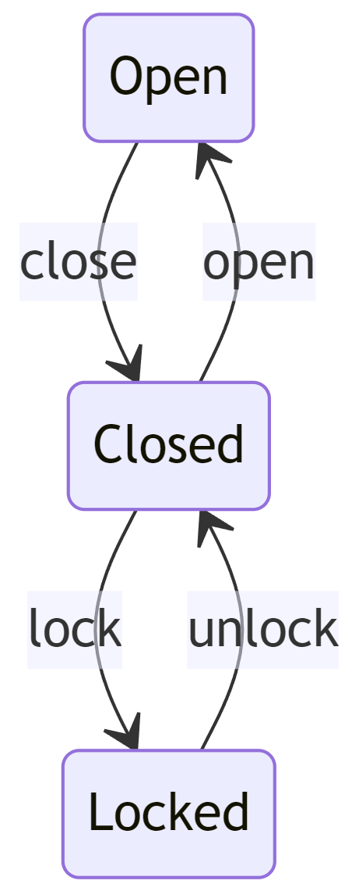

# Assignment 2 – Treasure Chests

## Value (%)

This assignment is worth 10% of your course grade.

## Task

Complete the implementation of the `TreasureChest` class, which represents a treasure chest with different states and properties. The class has a state machine representing the transitions between its states (open, closed/unlocked, and locked). You will need to implement the required methods to manipulate the chest's state based on the provided actions, such as opening, closing, locking, and unlocking.

## Key Components

- Implement the default and parameterized constructors.
- Implement the `Manipulate` method, which takes an `Action` and updates the state of the chest based on the state diagram.
- Implement the private `Unlock`, `Lock`, `Open`, and `Close` methods to update the chest's state accordingly.

## Testing

Ensure that your implementation works as expected by testing different actions and state transitions on a `TreasureChest` object.

## How to Complete This Assessment

1. Implement the default constructor:
   - Assign default values to `_material`, `_lockType`, and `_lootQuality`.

2. Implement the parameterized constructor:
   - Assign the values of `material`, `lockType`, and `lootQuality` to their corresponding private fields.

3. Implement the `Manipulate` method:
   - Implement a switch statement based on the provided `action` parameter.
   - For each action, check the current `_state` of the chest.
     - If the action is valid for the current state, call the corresponding private method (e.g., `Open`, `Close`, `Lock`, `Unlock`) and update the `_state` accordingly.
     - If the action is not valid, return null or throw an exception.
   - Return the updated state after performing the action.

4. Implement the `Unlock`, `Lock`, `Open`, and `Close` methods:
   - For each method, update the `_state` according to the state diagram.

5. There's no need to modify the `ToString` and `ConsoleHelper` methods as they are already implemented.

6. Ensure that the implemented methods are working as expected by testing different actions and state transitions on a `TreasureChest` object. You should write unit tests for the other methods as well.

## Note on Testing

When creating unit tests for the `TreasureChest` class, you should consider the following test cases to ensure correct functionality:

1. **Valid state transitions**: Test that the chest transitions correctly between states given valid actions (e.g., from open to closed, from closed to locked, from locked to closed, and from closed to open).

2. **Invalid state transitions**: Test that the chest does not change its state when given an invalid action for the current state (e.g., trying to lock an open chest, trying to open a locked chest without unlocking it first).

3. **Testing smaller methods**: Start by testing the smaller methods like `Open`, `Close`, `Lock`, and `Unlock` individually, as this will make it easier to test the larger `Manipulate` method. Once you have verified that these smaller methods work correctly, you can test the `Manipulate` method with greater confidence.

## Note on the Main Method

It is not necessary to use the `Main` method for this assignment, as the focus is on the `TreasureChest` class implementation. However, feel free to use the `Main` method for additional testing of your implementation to ensure it is working as expected.

## How to Submit Your Assessment

Submit a link to the GitHub repo containing your code.

## State Diagram

## Grading Rubric

## Results (70%)

| Points | Description                                                                                   |
|:------:|-----------------------------------------------------------------------------------------------|
|   7    | Excellent: Thorough test coverage including edge cases; all tests pass.                      |
|   6    | Good: Comprehensive test coverage with some edge cases; majority of tests pass.              |
|   5    | Satisfactory: Adequate test coverage; more than half of tests pass.                          |
|   3    | Needs Improvement: Limited test coverage; less than half of tests pass.                      |
|   1    | Poor: No tests or minimal tests; none of the tests pass.                                     |
|   0    | Code does not build in the CI workflow.                                                       |

## Class/Method/Variable Naming (10%)

| Points | Description                                                                                   |
|:------:|-----------------------------------------------------------------------------------------------|
|   1    | Excellent: Consistent, meaningful, and clear naming conventions for all classes, methods, and variables. |
|  0.75  | Good: Mostly consistent and meaningful naming conventions; minor inconsistencies or unclear names. |
|  0.5   | Needs Improvement: Inconsistent naming conventions; some unclear or confusing names.          |
|   0    | Poor: No clear naming conventions; many unclear or confusing names.                           |

## Comments/Documentation (10%)

| Points | Description                                                                                   |
|:------:|-----------------------------------------------------------------------------------------------|
|   1    | Excellent: Comprehensive comments and documentation; easy to understand the purpose and functionality of code. |
|  0.5   | Needs Improvement: Some comments and documentation, but lacking clarity or detail in certain areas. |
|   0    | Poor: No comments or documentation; difficult to understand the purpose and functionality of the code. |

## Formatting (10%)

| Points | Description                                                                                   |
|:------:|-----------------------------------------------------------------------------------------------|
|   1    | No formatting is required during the formatting workflow.                                     |
|  0.25  | Minimal formatting is required during the formatting workflow.                                |
|   0    | Extensive formatting is required during the formatting workflow.                              |
